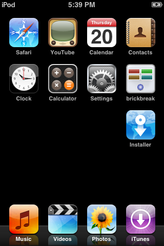

# FullIconList
This tweak aims to allow all icons to be displayed on iPhone OS 1.1-1.1.5.



Tested on:
- iPhone OS 1.1.1-1.1.4 on iPhone 1st generation
- iPhone OS 1.1-1.1.5 on iPod touch 1st generation

### How to install
Head over to the [Releases](https://github.com/theiphoneos1project/fulliconlist-iphoneos1/releases) section and download the `.PXL`. Install it with iBrickr using Windows XP. Make sure `MicroInjector` is already installed ([link](https://github.com/theiphoneos1project/MicroInjector/releases)).

### How to compile manually
Make sure you have [Theos](https://github.com/theos/theos) installed and configured.

Make sure you are in an environment with `clang` and have the unofficial iPhone OS 1 SDK. Also, make sure you have the patched `ld` with the Objective-C fragile runtime support. Feel free to modify the [`Makefile`](./Makefile) as needed for your paths. Additionally, make sure you have Python 3 installed to package the `.PXL` file.

Make sure you compile MicroInjector and have the `libmicroinjector.dylib` library. The `Makefile` is configured in such a way that if MicroInjector was cloned in the parent directory of this repo and compiled correctly, it would automatically detect it. If you clone and compile MicroInjector in a different place, you may need to modify the `Makefile` accordingly.

Clone the repo and the run this to compile the binary:
```bash
make clean && make
```
To package the `.PXL` file, run:
```bash
make pxl
```

#### License
This project is licensed under [MIT](LICENSE).

###### Copyright (c) 2026 Nightwind